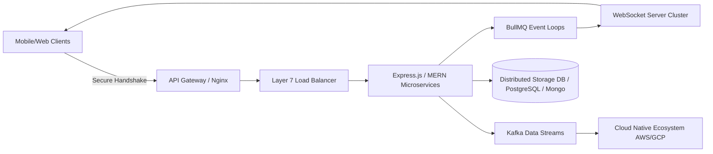

<div align="center">

# 👋 Hello! I'm **Prince Raj**

[](https://git.io/typing-svg)

<div align="center" style="margin: 15px 0;">
  
</div>

</div>

---

## 🚀 Professional Profile

> **Engineered for scale, optimized for absolute performance.** I am a solutions-driven Software Engineer with over 2 years of production-level experience designing, building, and deploying robust distributed systems. Specializing in the **MERN Stack**, distributed event streaming (**Kafka, Redis, BullMQ**), real-time communication (**WebRTC, Socket.io**), and cutting-edge **RAG (Retrieval-Augmented Generation) pipelines / MCP Servers**. I bridge the gap between high-throughput cloud infrastructure and clean, modular user interfaces.

* 🌱 **Currently Exploring**: High-performance AI pipelines, production-grade RAG models, context-aware applications, and cross-platform mobile apps.
* 📱 **Mobile Ecosystem**: Architecting seamless native-performing fluid bridges using **React Native**, customized through Xcode and Android toolchains.
* 💻 **Portfolio & Showcase**: Explore my live apps and case studies at [Portfolio](https://portfolio-three-lovat-41.vercel.app/)
* 📄 **Professional Timeline**: Review my verified enterprise experience via my [Curriculum Vitae / Resume](https://drive.google.com/file/d/1j90vn1gSOtaTZPSdQQipvpSbWFxjGCex/view?usp=sharing)

---

## 📊 Developer Dashboard & GitHub Analytics

<div align="center">
  <table border="0" cellpadding="0" cellspacing="0" style="border-collapse: collapse; border: none;">
    <tr style="border: none;">
      <td valign="top" style="border: none; padding: 5px;">
        
      </td>
      <td valign="top" style="border: none; padding: 5px;">
        
      </td>
    </tr>
  </table>
  <br>
  
</div>
 
---

## 🛠️ Technical Arsenal & Ecosystem

### 💻 Languages


### ⚙️ Backend, Messaging & Streaming Infrastructure


### 🎨 Frontend & Mobile Engineering


### 🗄️ Databases & Enterprise Storage


### ☁️ Cloud, DevOps & API Management


### 💳 Payment Gateways


### 🛠️ Collaboration & Engineering Workflows


---

## 💼 Core Competencies & Production Impact

* **System Architecture**: Designing deterministic Microservices, Event-Driven Architectures, CQRS patterns, and decoupled asynchronous execution channels.
* **Performance Tuning**: Scaled backend performance and reduced network latencies by up to **40%** using layered Redis caching clusters.
* **High-Throughput Streaming**: Managed massive concurrency pipelines utilizing Apache Kafka streams processing over **50k+ events/second**.
* **Real-time Engine**: Designed cluster-backed horizontally scalable WebSocket topologies powered by custom Redis and BullMQ delay/retry layers.
* **Cloud Orchestration**: Complete ownership of AWS architectures (EC2, S3, Lambda, SQS, RDS) and Google Cloud Native platforms (Cloud Run, Pub/Sub).

### 📈 Production Metrics At A Glance

```yaml
Enterprise System Deployments: 12+ Production Environments
Peak Traffic Handling Capacity: 50k req/s (REST API Gateway)
Asynchronous Stream Throughput: 100k events/s (WebSocket/Kafka Pipeline)
SLA Architectural Baseline : 99.95% High-Availability Target
Peer Performance Leadership  : Reviewed & Guided over 200+ Production PRs
```

### 🏗️ Featured Production System Architecture



### 🎓 Academic Background

- **Bachelor of Technology (B.Tech)** in Computer Science & Engineering  
  *RIMT University (2021 — 2025)*

---

### 🤝 Let's Connect & Build

Available for systems consulting, cloud backend design architectural optimization, or next-generation AI pipeline integrations.
<br>

<div align="center">
> 🎯 *"Building infrastructure that doesn't just scale — it dominates performance thresholds."*
</div>
